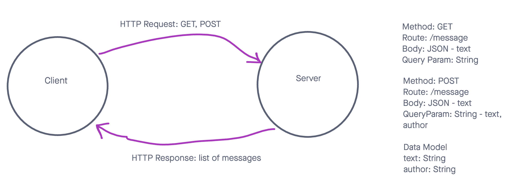

# express-server-deployment

HTTP Express Server deployed on Heroku

Deployment URL: [https://express-server-deployment-sjt.herokuapp.com/](https://express-server-deployment-sjt.herokuapp.com/)

## Installation

run: `git clone git@github.com:SpencerTower/express-server-deployment.git`

`cd` into express-server-deployment

## Usage

To start server, run: `npm start`

To test server, run: `npm text`

## Routes

- GET `/message`: returns a list of Message objects
- POST `/message`: creates a message, saves the message by adding it to the list of messages, and returns the list of messages.

## Features

- Message:
  - Constains String: Text
  - Constains String: Author
  - Saves messages
  - Returns list of messages